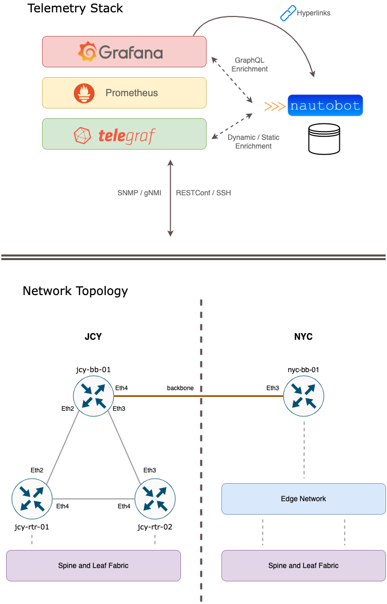
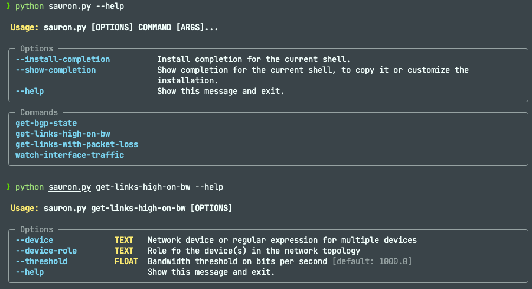
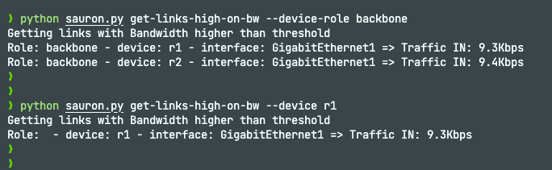
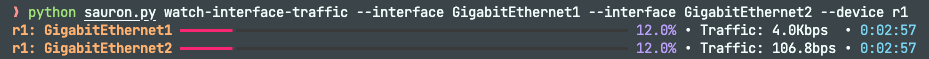

# Take advantage of the Telemetry Stack!

This repository aims to provide a lab environment to practice concepts for the DevNet workshop "Take Advantage of your Telemetry Stack! How to Retrieve Data Programmatically to Aid in your Network Operations - DEVWKS-2452".

It provides setup instructions for a network lab with multiple CSR1kv devices to get telemetry data on. It also provides setup and instructions to setup a small Telemetry Stack based on Telegraf, Prometheus and Grafana to capture, normalize, store and visualize the data.

Optionally you can setup a Nautobot instance that hold extra information of the network devices topology that can further enrich the data obtained from the Telemetry Stack.

## Setup Network Lab (containerlab)

TBD

## Setup Telemtry Stack (TPG)

TBD

## Setup Nautobot for data enrichment (Optional)

TBD

## CLI Scripts

TBD

### Sauron example

