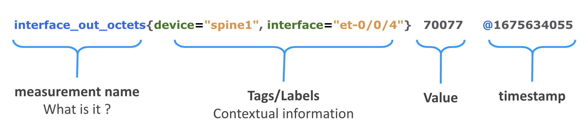
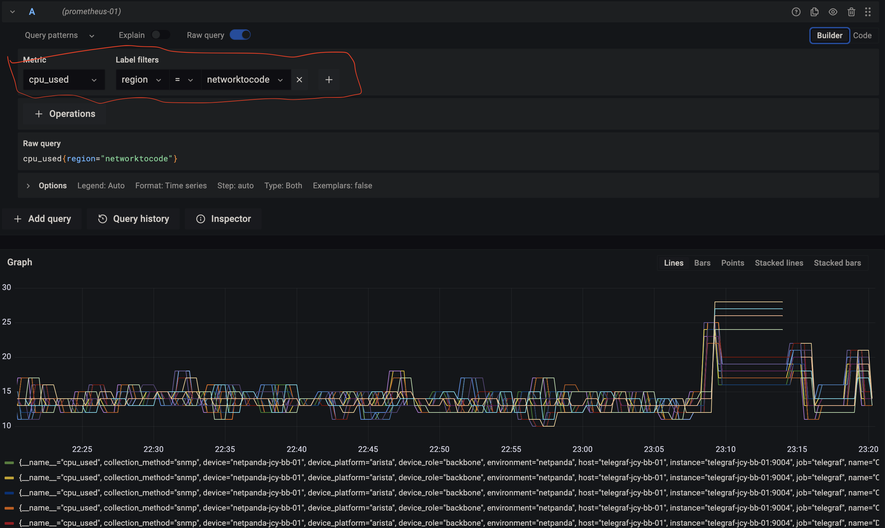
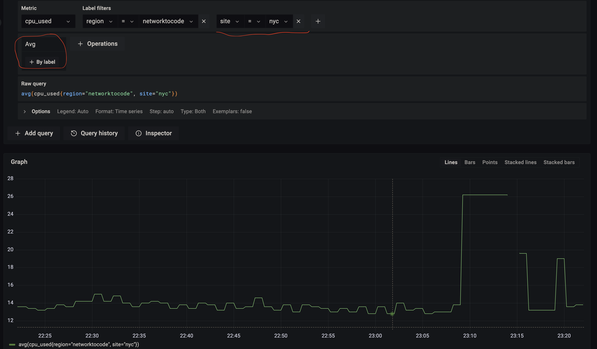
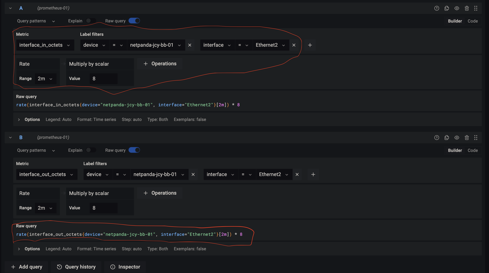
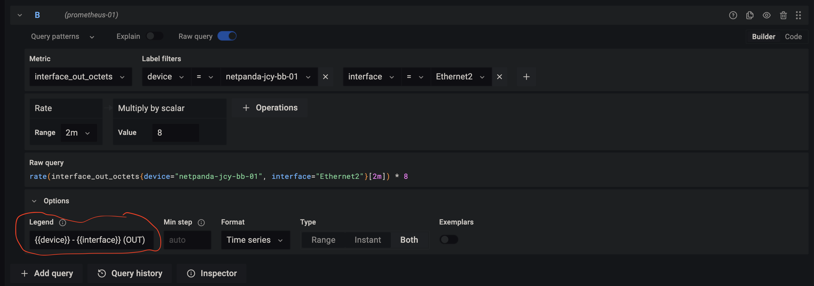
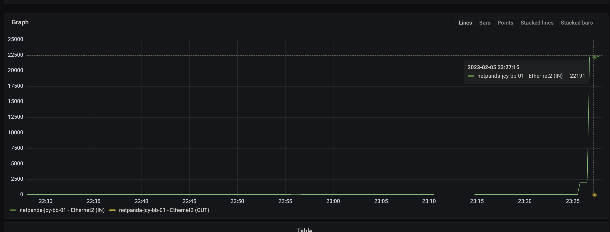
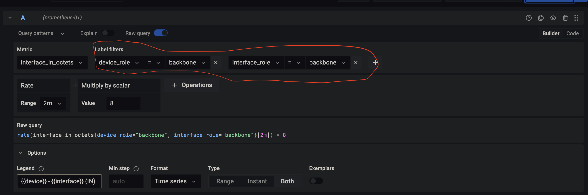
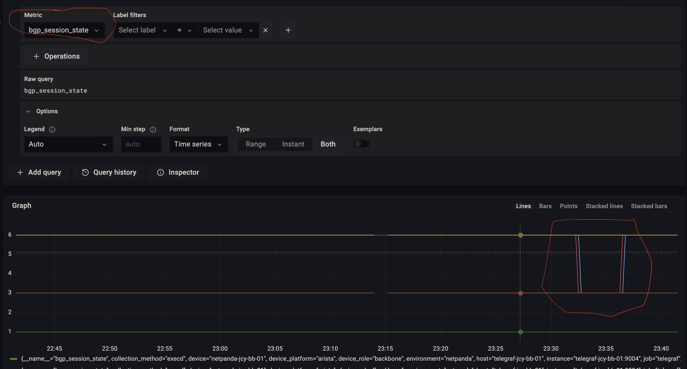
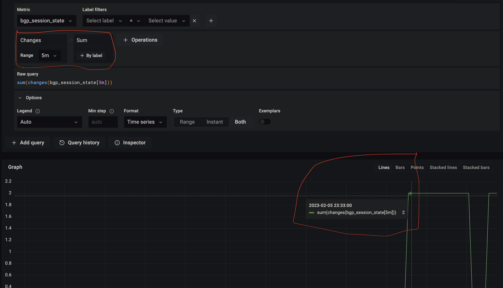

# Lab 1 - Let's play with PromQL and Grafana

The first part of the Lab is focused on PromQL capabilitites and how we can use Grafana and its query builder to ask relevant questions around the network operational state.

## PromQL concepts and tips for the lab

Prometheus provides a functional query language called [PromQL](https://prometheus.io/docs/prometheus/latest/querying/basics/) (Prometheus Query Language) that lets the user select and aggregate time series data in real time.

The anatomy of a metric is the following.

For the lab we will be mainly using the following measurement names:

- `interface_in_octets`: Counter that shows interface inbound octects/bytes
- `interface_out_octets`: Counter that shows interface outbound octects/bytes
- `bgp_session_state`: Gauge value that shows the state of the BGP session.

Among the multiple label values you can use to filter the data, these are the mainly used in the lab:

- `region`
- `site`
- `device`
- `device_role`
- `interface`
- `interface_role`

Finally, there are multiple aggregation and range functions you can use to make operations with the data stored in Prometheus. These are the ones mainly used for the lab:

- [`rate`](https://prometheus.io/docs/prometheus/latest/querying/functions/#rate): Could be used to represent traffic utilization of network interfaces (i.e. **Bps** or **bps**).
- [`changes`](https://prometheus.io/docs/prometheus/latest/querying/functions/#changes): Useful for metrics where the **state** monitored and you want to represent the transitions.
- `sum`: This is an aggregator function usefull in many of the queries of the lab.

## Tasks

### 1- Perform a query to visualize the CPU usage of the network devices in one region

Solution

Graphs for CPU Utilization

### 2 - Perform a query to visualize traffic utilization (bps) of Ethernet2 in netpanda-jcy-bb-01

Solution

Traffic Utilization

### 3 - Perform a query to visualize traffic on backbone links

Solution

Traffic utilization for a specific role

### 4 - Perform a query to visualize the BGP states transitions during the last 30 minutes

Solution

Depiction of BGP Transitions seen by the default timeseries

### 5 - Perform a query to visualize a sum of ONLY the BGP state transitions in a range of 5 minutes

Solution

BGP Transitions captured in a window of 5 minute interval.

In the picture the highlighted section shows a BGP transition (2 events, one for each BGP neighbor).

